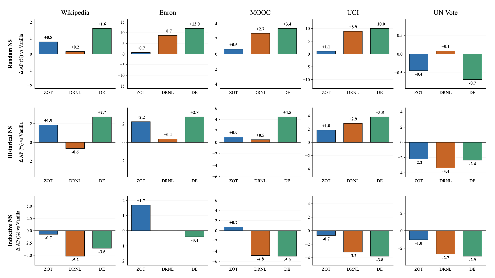

# Edge Prediction in Dynamic Graphs: A Research-Oriented Analysis of Temporal Graph Learning Methods

- All datasets are available [here](https://zenodo.org/records/7213796#.Y1cO6y8r30o)

## Introdution

This repository investigates the impact of structure-aware node labeling on temporal link prediction in dynamic graphs. The experiments evaluate whether explicit structural information improves the performance of Temporal Graph Networks (TGNs) under different graph dynamics and negative sampling protocols.

We compare several structural labeling methods, ranging from a lightweight Zero-One-Two (ZOT) heuristic to more expressive approaches such as Double Radius Node Labeling (DRNL) and Distance Encoding (DE). The evaluation is conducted on five real-world temporal graph datasets using random, historical and inductive negative sampling.

The results show that the effectiveness of structural information depends on the characteristics of the underlying network. Rich structural encodings benefit rapidly evolving graphs with many unseen interactions, while simpler labeling strategies are sufficient for highly recurrent networks.



## Run Experiments
```sh
uv run src/run.py \
  experiment_name=test \
  seed=42 \
  dataset=enron \
  negative_sampling=random \
  model=se_tgn \
  labeling=zot
```

### Arguments

- experiment_name - name of the experiment run
- seed - random seed for reproducibility
- dataset - dataset name. To add a new dataset, create a `{dataset}.yaml` file in `config/dataset/`
- negative_sampling - one of: `random`, `historical`, `inductive`
- model - `tgn` or `se_tgn`
- labeling - only for se_tgn: one of `zot`, `drnl`, `de`

### Notes

- labeling is only used when model=se_tgn
- dataset must exist in config/dataset/

## Research Dissemination
A subset of the results presented in this project was disseminated in the following scientific article:
    **"Edge Prediction in Dynamic Graphs: Enhancing Temporal GNNs through Structural Node Features"** 
M. Kobiera, R. Wiatr, R. G. Słota
*Presented at the 7th Polish Conference on Artificial Intelligence (PP‑RAI), Kraków, Poland, April 20–22, 2026*

